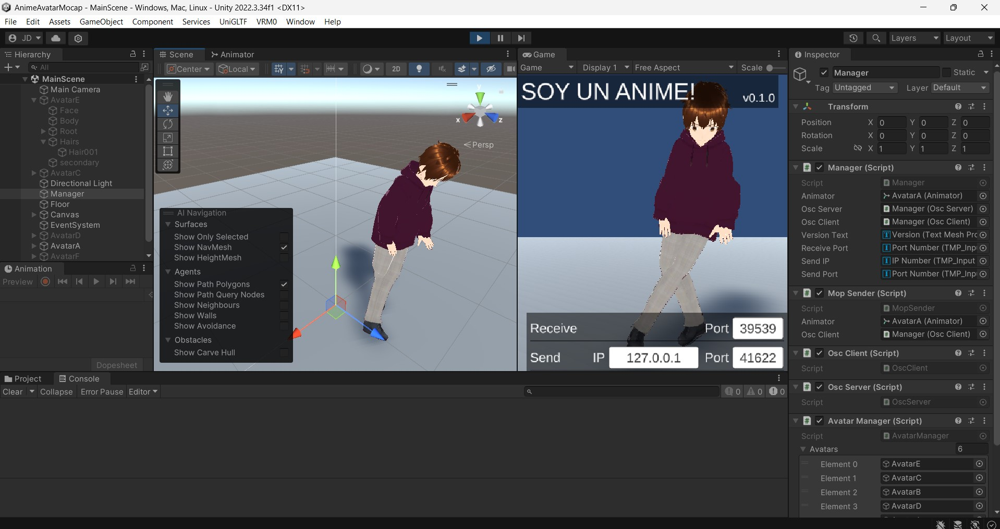

# AnimeMocapDemo - Soy un anime!

AnimeMocapDemo is a demo application based on the Virtual Motion Capture Protocol (VMCProtocol - https://protocol.vmc.info/), a communication protocol for virtual motion capture. The application takes information from a real-time markerless mocap system to capture the user's pose and applies it to a 3D avatar model. Using a simple camera, you can control different anime avatars without the need to use complex mocap systems or implement VR interfaces! Any 3D model compatible with the VRM standard (https://vrm-consortium.org) can be used in the application. It is a very useful tool for engaging children in activities that combine technology and creativity!

## Requirements

1. Unity3D version 2022 or later.
2. A real-time markerless mocap application compatible with the VMC protocol. We recommend Virtual Motion Capture VMC (https://github.com/sh-akira/VirtualMotionCapture) (opensource) or ThreeDPoseTracker (https://github.com/digital-standard/ThreeDPoseTracker) (paid).
3. A PC with a GPU RTX2080Ti o later. ThreeDPoseTracker uses AI to infer the user's pose based on the interpolation of frames from the camera.
4. A simple USB camera.
5. An empty, colored uniform wall or surface. For better results, we recommend using a green chroma.

## Setup 

1. Download and execute VCM or ThreeDPoseTracker (A trial version of ThreeDPoseTracker can be downloaded here: https://drive.google.com/file/d/1ECaozI2Dn6_D0fvaQBge1ge_P-5d3wXK/view?usp=drive_link).

2. Execute ThreeDPoseTracker.exe, then in the option 'Source Device', select your USB Camera device. 

3. Ensure you see the camera input and the anime girl respond to your movements. It is necessary that the camera captures your whole body in order to see the avatar in action.

4. Select the configuration menu, then select the 'Others' tab. Check the option "Send VMC protocol" and then click the "Apply" and "OK" buttons. By default, the application uses UDP port 39539. Sometimes, this port can be blocked by the Windows firewall. Do not close ThreeDPoseTracker.

5. Download the project code, open the MainScene scene file, and execute it in Unity3D. The avatar should start to change its pose automatically if the connection between ThreeDPoseTracker and Unity is correct. If the avatar does not change its pose, check the ports are correctly configurated and create the inbound and outbound UDP rules in the firewall.

6. Use the left and right arrow keys to change the avatar, there are six different characters! You can dowload more anime-like VRM compatible characters in VROID https://hub.vroid.com/en

7. Before start, ensure that the user is located at a good distance from the camera, close to the wall or chroma, and with good lighting conditions. That's all! You'll see the avatar in Unity responding to the user's movements. Don't worry if the avatar sometimes remains static; some pauses occur because ThreeDPoseTracker only captures a few seconds in the trial version. To prevent that, you can use VMC instead, which is free (https://github.com/sh-akira/VirtualMotionCapture - sorry, most of the documentation is in Japanese).

## Credits

Developed by Jose L. Dorado (jl.dorado59@uniandes.edu.co,  jl-dorado@hotmail.com). Most of the credits are for @sh_akira (https://x.com/sh_akira) developer of VMC . If you find this app useful, please donate to the VMC project https://sh-akira.booth.pm/items/999760.  

